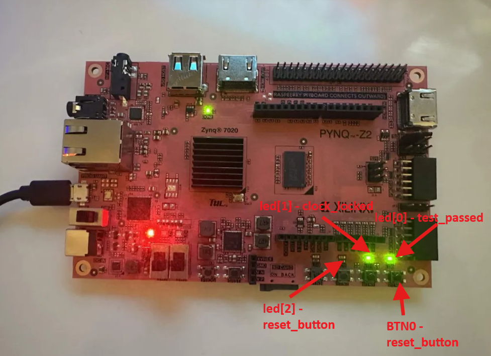
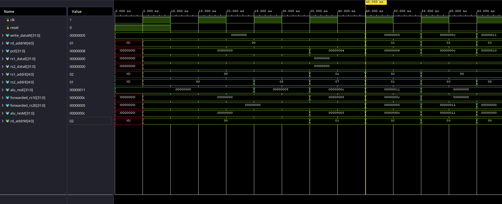
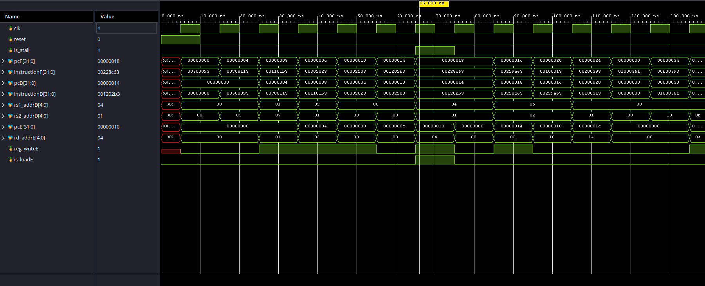
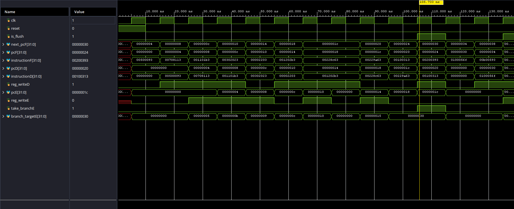
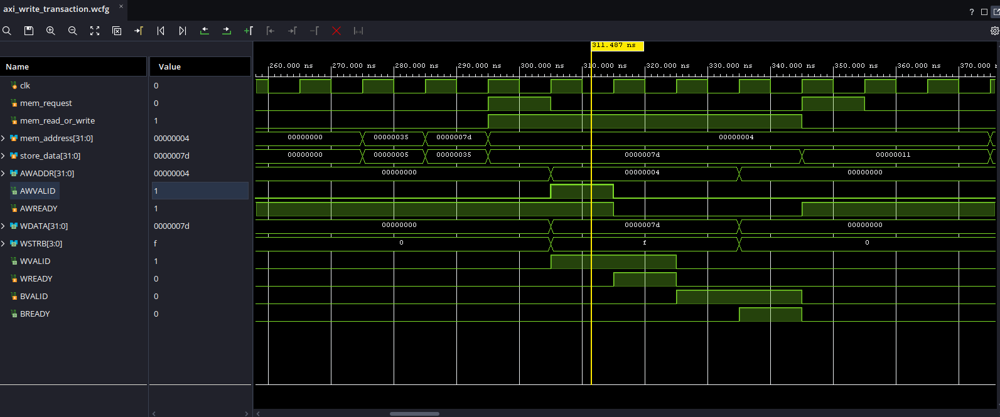
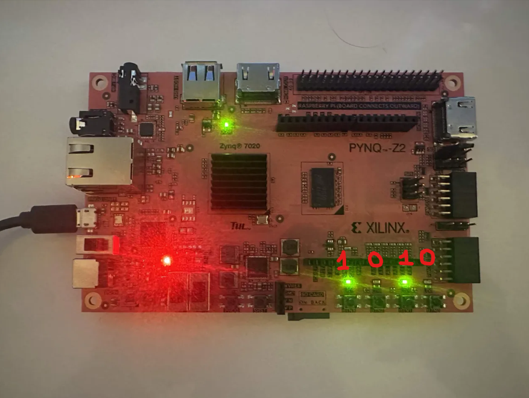
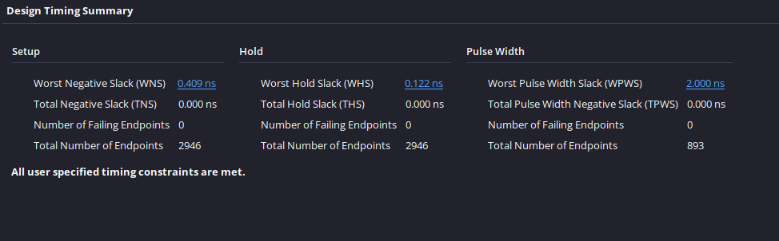
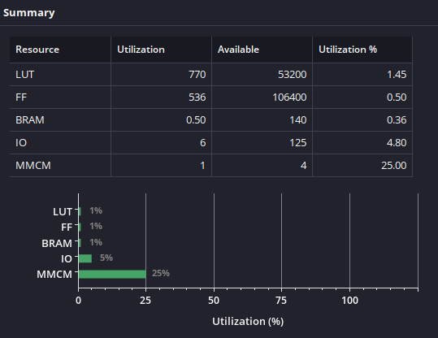

# Five-Stage RISC-V FPGA SoC

A custom RV32I FPGA System-on-Chip implemented in SystemVerilog, featuring a five-stage pipelined processor, AXI4-Lite master and interconnect, 64 KiB of BRAM data memory, GPIO, UART and timer peripherals. The design was verified using self-checking SystemVerilog testbenches and deployed on a PYNQ-Z2 FPGA at 100 MHz.

## Key Results

- Implements a five-stage IF/ID/EX/MEM/WB pipeline capable of completing up to one instruction per clock cycle after filling.
- Supports arithmetic, logical and immediate instructions, LUI/AUIPC, word loads and stores, six branch conditions, JAL and JALR.
- Handles data hazards using Memory and Write Back forwarding alongside single-cycle load-use stalls.
- Handles control hazards by flushing wrong-path instructions after taken branches and jumps.
- Uses an AXI4-Lite master and an interconnect for addressable communication between the CPU and the SoC peripherals.
- Includes 64 KiB of BRAM data memory, GPIO, UART and timer peripherals.
- Passed self-checking module tests and an integrated processor test with all 21 expected register values matching through the AXI and BRAM memory path.
- Verified communication between CPU and peripherals on the PYNQ-Z2 by writing 0b1010 through the AXI GPIO peripheral and observing the corresponding LED pattern.
- Deployed and verified on a PYNQ-Z2 FPGA using a 100 MHz processor clock.
- Passed timing with +0.409 ns setup slack, +0.122 ns hold slack and zero failing endpoints.
- Uses 1115 LUTs, 767 flip-flops, 16 Block RAM tiles and one MMCM.

<p align="center">
  <br>
  <em>Hardware result: <code>led[0]</code> indicates test passed, <code>led[1]</code> indicates clock locked and <code>led[2]</code> is the reset indicator.</em>
</p>

## Overview

This project describes a custom RISC-V FPGA SoC written in SystemVerilog. The CPU has an RV32I instruction set architecture, arithmetic calculations, memory access, branching and jumping. As well, the microprocessor uses forwarding, load-use stalls, memory-access stalls and flushing to maintain correct execution when multiple instructions are overlapping in the pipeline.

The SoC includes 64 KiB of BRAM data memory together with GPIO, UART and timer peripherals. The design is synthesized and implemented in Vivado, then deployed on a PYNQ-Z2 FPGA running at 100 MHz using the generated bitstream.

Each instruction execution is divided into five pipeline stages:

- Instruction Fetch (IF)
- Instruction Decode (ID)
- Execute (EX)
- Memory Access (MEM)
- Write Back (WB)

Pipeline registers separate each stage, which allow multiple instructions to be processed simultaneously. After having every pipeline filled, the processor is able to complete up to one instruction per clock cycle.

Having overlapping instructions creates various data and control hazards. The processor uses forwarding paths from the Memory and Write Back stages to provide recent results directly to the Execute stage when possible. A load-use hazard stalls the pipeline for one clock cycle when the required value is not yet available. Taken branches and jumps redirect the program counter and flush instructions fetched from the incorrect execution path. These mechanisms preserve correct program execution while retaining the increased throughput provided by pipelining.

## Architecture

### <u>Five-Stage Datapath</u>

The processor divides instruction execution between five stages. Each stage performs a specific part of the instruction and then passes the results to the subsequent stage.

#### Instruction Fetch (IF)

- The program counter provides the address of the next instruction in instruction memory.
- Under normal execution, the program counter advances by four bytes.
- A taken branch or jump instead redirects it to a target address calculated in the Execute stage.

#### Instruction Decode (ID)

- The fetched instruction is decoded to determine the required operation and control signals.
- The register file reads the source registers rs1 and rs2
- The immediate generator extracts and extends the required immediate value from the instruction.

#### Execute (EX)

- The ALU performs any required arithmetic, logical, comparison or address calculation.
- This stage also evaluates branch conditions and calculates branch or jump target addresses.
- Forwarding multiplexers select the newest available source-register values before they enter the ALU.

#### Memory Access (MEM)

- Load/store instructions create memory requests using the address (calculated by the ALU).
- These requests are sent to the AXI4-Lite master, which communicates with either BRAM or one of the peripherals.
- If the AXI transaction has not yet completed, the pipeline remains stalled until the response is received.

#### Write Back (WB)

- The final result is selected from the ALU result, loaded memory data or return address (`PC + 4`).
- This value is written into the destination register `rd` when register writing is enabled.

### <u>Pipeline Registers</u>

Four sets of pipeline registers separate the five stages. These registers store the data and control signals produced by one stage before providing them to the subsequent stage on the next rising clock edge. This keeps the information belonging to each instruction together as it moves through the pipeline.

#### IF/ID Register

- Stores the fetched instruction, current program counter and `PC + 4`.
- Provides the instruction and program counter values required by the Decode stage.

#### ID/EX Register

- Stores the register values read from `rs1` and `rs2`, immediate value, register addresses and program counter values.
- Passes the decoded control signals required by the Execute, Memory Access and Write Back stages.

#### EX/MEM Register

- Stores the ALU result, store data, destination register address and `PC + 4`.
- Passes the memory and write-back control signals required by the remaining stages.

#### MEM/WB Register

- Stores the ALU result, data loaded from memory, destination register address and `PC + 4`.
- Passes the result-selection and register-write control signals into the Write Back stage.

During reset, the pipeline registers are cleared. The hazard unit can also hold or clear selected pipeline registers when a stall or flush is required.

### <u> Control Unit </u>

In the ID stage, the control unit decodes each instruction that is being passed through. It uses the instruction opcode, `funct3` and `funct7` fields to determine the required operation and generate its control signals.

The generated control signals determine:

- The operation performed by the ALU.
- Whether the ALU operands come from register data, an immediate value, the program counter or zero.
- The immediate format extracted from the instruction.
- Whether data memory or the register file can be written to.
- Whether the final result comes from the ALU, data memory or `PC + 4`.
- Whether the instruction performs a branch or jump.

The control signals are stored in the ID/EX pipeline register and move through the pipeline alongside their instruction data. Each signal remains aligned with its instruction until it reaches the stage where it is required.

### <u> Hazard Handling </u>

- Hazards can occur when there are overlapping instructions for which an instruction depends on the result for a previous instruction for which the result has not yet reached the WB stage
- Could also happen when execution is redirected by a jump or branch.
- The hazard unit handles these situations using forwarding, stalls and flushing.

#### Data Forwarding

- The source registers in the Execute stage are compared with the destination registers in the Memory and Write Back stages.
- When a matching destination register has register writing enabled, its newest result is forwarded directly to the required Execute-stage operand.
- A result from the Memory stage receives priority over a result from the Write Back stage because it belongs to the more recent instruction.
- Register x0 is excluded from forwarding because it always contains zero.

#### Load-Use Stall

- A load instruction receives its data after the Execute stage, meaning its result cannot immediately be forwarded to the following instruction.
- If the following instruction requires the loaded register value, the program counter and IF/ID register are held for one clock cycle.
- The ID/EX register is cleared to insert a bubble into the pipeline. Execution continues once the loaded value becomes available for forwarding.

#### Control-Hazard Flushing

- During the EX stage, branch conditions and jump target addresses are resolved.
- If a branch or a jump occurs, program counter will be redirected to the calculated target address.
- Instructions in the Fetch and Decode stages belong to the incorrect execution path and are flushed before they can change the processor state.

#### Memory-Access Stall

- When a load or store reaches the Memory stage, the processor sends a request to the AXI4-Lite master.
- An AXI transaction can require multiple clock cycles.
- The pipeline prevents the memory instruction from leaving the Memory stage.
- Earlier pipeline stages are held to prevent new instructions from advancing.
- Once the AXI master receives the required read data or write response, normal pipeline execution continues.

#### AXI4-Lite Master

- The processor communicates with BRAM and address-based peripherals through a custom AXI4-Lite master.
- Load/store requests from the processor are converted into AXI transactions using VALID/READY handshakes.
- For reads, the master sends the requested address and waits for the returned data.
- For writes, the master sends the address and write data. Waits for the write response.
- Once the transaction is complete, the master can signal the processor to continue execution.

#### AXI4-Lite Interconnect

- The AXI4-Lite interconnect connects the AXI master to the SoC memory and peripherals.
- It checks the requested address and routes the transaction to the correct slave.
  - 0x0000_0000 to 0x0000_FFFF → BRAM
  - 0x1000_0000 to 0x1000_0FFF → GPIO
  - 0x1000_1000 to 0x1000_1FFF → UART
  - 0x1000_2000 to 0x1000_2FFF → Timer
- The interconnect also routes the selected slave's response back to the AXI master.

#### GPIO

- The GPIO peripheral uses:
  - 4 input bits
  - 4 output bits
- Address 0x1000_0000 updates the GPIO outputs.
- Address 0x1000_0004 accesses the GPIO inputs.
- The GPIO output path was also verified on hardware by writing 0b1010 and observing the same pattern on the FPGA LEDs.

#### UART

- The UART peripheral provides serial transmit and receive functionality.
- The processor can write data to the UART transmitter
- The processor can read received data and check transmitter/receiver status through addressable registers.
- This allows UART communication using normal RISC-V load and store instructions.

#### Timer

- The timer contains a 32-bit counter, control register, compare register and status register.
- The processor can enable/clear the counter, set a compare value and check when the compare value has been reached.

### <u> FPGA Top-Level System </u>

The FPGA top-level system connects the board clock and reset inputs to the pipelined processor core. The instruction and data memories are included within the processor system, allowing a test program and its required data values to be initialized before synthesis.

Once reset is released, the program counter begins at its reset address and the processor starts executing the stored instructions through the five pipeline stages. Predicted results can then be used to confirm observed outputs from the processor.

`riscv_fpga_top` contains the RISC-V CPU, AXI4-Lite master and its interconnect, BRAM, GPIO, UART and timer.

`instruction.mem` is initialized in instruction memory and load/store instructions access BRAM and the peripherals.

Vivado synthesizes and implements the complete system for the PYNQ-Z2. The generated bitstream is programmed onto the FPGA and used to test the processor in hardware.

## Verification and Results

The processor and SoC components were verified using self-checking SystemVerilog testbenches.

The original processor tests covered the register file, instruction memory, decoder, ALU, forwarding, load-use stalls and control-hazard flushing.

In addition, the same testing method verified the AXI4-Lite master, AXI interconnect, BRAM, GPIO, UART and timer peripherals.

The complete system was then tested using `riscv_pipelined_tb`. The test program was loaded from `instructions.mem` and executed through the full processor, AXI master, interconnect and BRAM path.

After execution, registers `x1` through `x21` were compared against their expected values. All 21 registers matched.

### Data Forwarding Test

In `riscv_pipelined_tb`, the test first calculates `x1 = 5` and `x2 = 12`, followed immediately by an instruction which adds both values into `x3`. When this instruction reaches the Execute stage, its original register values are both zero because the previous instructions have not completed Write Back.

The forwarding logic detects that `rs1` address matches the `rd` address in the Memory stage. At the same time, the logic detects `rs2` address matches the `rd` address in the Write Back stage. The system then forwards the values 12 (`x2`) and 5 (`x1`) directly into the EX stage, allowing the ALU to correctly produce `x3 = 17` without stalling.



### Load-Use Stall Test

A load instruction reads the value 17 from memory into `x4`. The following instruction immediately requires `x4` to calculate `x5 = x4 + x1`. Since the loaded data is not available early enough for immediate forwarding (still in EX stage), the hazard unit stalls the pipeline for one clock cycle.

During the stall, the program counter and IF/ID register remain unchanged. The ID/EX register is cleared to insert a bubble into the Execute stage. Once the loaded value becomes available, execution continues and the processor correctly calculates `x5 = 22`.



### Control-Hazard Flushing Test

This occurs in the test when a taken branch redirects `PC` to address 48. When the branch is calculated in the EX stage, `take_branchE` and `is_flush` are asserted while `branch_targetE` contains the target address.

The instructions currently in the IF and ID stages belong to the wrong execution path. These instructions are flushed (meaning all values are cleared) and the `PC` is redirected and execution continues from the branch target.



### AXI Write Transaction Test

From `instruction.mem`, the store instruction `sw x19, 4(x0)` writes `125` to address `0x00000004`

The waveform shows the CPU request being converted into an AXI write transaction, followed by the address, data and response handshakes.



### GPIO Hardware Test

The processor writes a 4-bit value `1010` to the GPIO output using AXI.

The PYNQ-Z2 LEDs illuminate with the same `1010` pattern, confirming the complete CPU -> AXI master -> interconnect -> GPIO -> FPGA LED path.



## Synthesis and FPGA Deployment

The RV32I based processor was synthesized and implemented in Vivado for the PYNQ-Z2's XC7Z020 FPGA. Since an FPGA does not have a universal clock, Clocking Wizard has to convert the board's 125 MHz input clock into a 100 MHz processor clock. The SoC will stay in reset mode until the generated clock is able to stabilize for which the Clocking Wizard asserts `clock_locked`.

After implementation, the design met all timing constraints with zero failing endpoints. The results:

- Worst setup slack: +0.409 ns
- Worst hold slack: +0.122 ns
- Worst pulse-width slack: +2.000 ns



The generated bitstream was programmed onto the PYNQ-Z2. The FPGA top-level module executes the test program stored in instruction memory and monitors the processor's Write Back stage through `debug_pc` and `debug_write_data`.

When the instruction at address 96 reaches Write Back with the expected result of 130, the top-level module sets a sticky test_passed signal. This signal remains active until the processor is reset.

The onboard LEDs indicate the hardware state:

- `led[0]` turns on when the processor completes the test with the expected result.
- `led[1]` indicates that the Clocking Wizard has locked and the 100 MHz processor clock is stable.
- `led[2]` turns on while the reset button is pressed.
- `led[3]` is unused

Pressing BTN0 resets the Clocking Wizard and processor while clearing `test_passed`. After the button is released, the clock locks again and the processor restarts the onboard test.

## Resource Utilization

The implemented system uses 1115 LUTs (2.10%), 767 flip-flops (0.72%), 16 Block RAM tiles (11.43%) and 6 I/O ports (4.80%). The single MMCM is used by the Clocking Wizard to generate the 100 MHz processor clock. The six I/O ports correspond to the board clock, reset button and four LED outputs.



## How to Run

### Integrated SoC Simulation

1. Open `riscv_single_cycle.xpr` in Vivado.
2. Under Simulation Sources, set `riscv_pipelined_tb` as the simulation top.
3. Run Behavioral Simulation.
4. Select Run All and confirm that the Tcl Console reports:

```
ALL PIPELINE TESTS PASSED
21/21 REGISTERS MATCHED
```

The testbench loads the program from `instructions.mem`, executes it for 150 clock cycles and automatically compares registers `x1` through `x21` against their predicted values.

To inspect the processor cycle by cycle, set `riscv_pipelined_tb_display` as the simulation top instead. This testbench displays the pipeline stages, forwarding values, stall signal and flush signal during execution.

Individual module testbenches can also be selected as the simulation top to verify components such as the ALU, decoders, register file and memories separately.

### FPGA Deployment

1. Set `riscv_fpga_top` as the design top module.
2. Ensure that the PYNQ-Z2 constraint file and Clocking Wizard are enabled.
3. Run synthesis and implementation.
4. Generate the bitstream.
5. Connect and power on the PYNQ-Z2.
6. Open Hardware Manager and select Open Target → Auto Connect.
7. Select the XC7Z020 device, click Program Device and use the generated bitstream.

For the hardware test:

- `led[0]` : indicates that the processor reached the expected result.
- `led[1]` : indicates that the 100 MHz processor clock is locked.
- `led[2]` : indicates reset.
- `led[3]` : is unused.

For the GPIO hardware test, a temporary program can write `4'b1010` to the GPIO output register, illuminating the same 1010 pattern on the four onboard LEDs.
